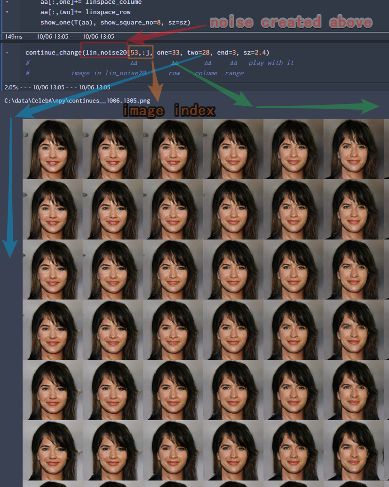

# GAN2Play

Let you to play with pretrained GAN (SAGAN + SNGAN + D2GAN)

#Requirement:
* old fastai 0.7 (put in the same file)
* python 3.6
* pytorch 0.4
* test on windows 10, cuda 9.0 

# Results

change to your dir of dataset: put your image in **file train**.
It is **ok without any dataset and just play the pretrained GAN**.

##
Train on Guassian but generate on uniform will make the image looks better,
but the uniform images look more similar.

## Continues change on row and colume.

# multi_noise display.
show different results in mult std.
small std make image looks more similar,
large std make image looks more difference.

